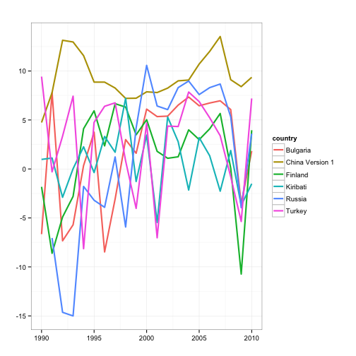

## Overview 
Hopefully, I can give you an idea about the following
>  * What is R?
>  * How does it work? 
>  * Why learn it? 

---

## What is R?
- R is an Open Source environment for statistical computing and graphics
- Available for Windows, Mac OS X, and Linux
- R is being actively developed with two major releases per year and dozens of releases of add on packages
- R can be extended with 'packages' that contain data, code, and documentation to add new functionality

```
install packages("foreign")
install_github("slidify", "ramnath")
```

---

## A bit of history
- R is a flavor of the **S** computer language
- S was developed by John Chambers at Bell Labs in the late 1970s
- Version 4 of S, the latest version, was finished in 1998
- In 1991, Ross Ihaka and Robert Gentleman create R
- R is named for their first initials

---

## John Chambers on the philosophy of S
    
"[W]e wanted users to be able to begin in an interactive environment, where they did not consciously think of themselves as <span class = 'red'>programming</span>. Then as their needs became  clearer and their sophistication increased, they should be  able to <span class = 'red'>slide gradually</span> into programming, when the language and system aspects would become more important."

<p align='left'>  </p>

---

## Free lunch?
- R is free in many senses
  1. R can be run and used for any purpose, commercial or non-commercial, profit or not-for-profit
  2. R's source code is freely available so you can study how it works and adapt it to your needs.
  3. R is free to redistribute so you can share it with your ~~enemies~~  friends
- Try not to think too much as an economist, and consider the social contract
  * Chip in a little...and get a lot back

---

## R advantages
- R is platform agnostic - works with Linux, Mac, PC, etc.
- R can read and write Stata, SPSS, SAS, Excel files
- R is encredibly flexible and can be adopted to almost any need
- You can collect, clean, analyze, vizualize and present data all from within R
- ... and much more depending on interest!

---

## R drawbacks
- R is based on S, almost 40 years old 
- Open source means you have to check packages
- R is a programming language, not a software package--steep learning curve
- R can be slow
- Lack of panel data - and possibly time series - packages

---

## Components of an R setup
- [R](http://cran.r-project.org/) - works, but not easy to work with
- [RStudio](http://www.rstudio.com/ide/download/) - a syntax highlighter that makes R much more accessible

---

## How does RStudio look?

<iframe src = 'http://www.rstudio.com/ide/' height='400px'></iframe>

---

## R as a calculator

```r
2 + 2  ## add numbers
```

```
## [1] 4
```

```r
2 * pi  #multiply by a constant
```

```
## [1] 6.283
```

```r
7 + runif(1, min = 0, max = 1)  #add a random variable
```

```
## [1] 7.32
```


---

## Objects
- Everything in R is an object - even functions and graphs
- Objects can be manipulated in many ways
- This will prove important if you decide to learn R

---

## Let's look at data 
- Look at some data from PWT from 1990-2010 for 6 random countries

```r
library(pwt)
data(pwt7.1)
myData <- pwt7.1
row.names(myData) <- NULL
names <- unique(myData$country)
c <- as.character(sample(names, 6))
myData <- subset(myData, year > 1988 & country %in% c)
myData[1:5, 1:6]
```

```
##       country isocode year  pop    xrat      currency
## 1565 Bulgaria     BGR 1989 8990 0.00084 Bulgarian Lev
## 1566 Bulgaria     BGR 1990 8894 0.00219 Bulgarian Lev
## 1567 Bulgaria     BGR 1991 8772 0.01779 Bulgarian Lev
## 1568 Bulgaria     BGR 1992 8659 0.02334 Bulgarian Lev
## 1569 Bulgaria     BGR 1993 8442 0.02759 Bulgarian Lev
```


---

## Plots 
We can create two simple plots with the following

```r
library(plyr)
library(ggplot2)
myData <- ddply(myData, .(country), transform, Lrgdpch = c(NA, rgdpch[-length(rgdpch)]))
myData <- subset(myData, year >= 1990)
myData$rgdpch1 <- (myData$rgdpch - myData$Lrgdpch)/myData$Lrgdpch * 100

plot1 <- ggplot(myData, aes(x = year, y = rgdpch1, color = country)) + geom_line(size = 1) + 
    labs(list(title = "", x = "", y = "")) + theme_bw() + theme(strip.text.x = element_text(size = 11), 
    strip.background = element_rect(fill = "white"))

plot2 <- ggplot(myData, aes(x = year, y = rgdpch1)) + geom_line(size = 1) + 
    labs(list(title = "", x = "", y = "")) + theme_bw() + facet_wrap(~country, 
    scales = "fixed") + theme(strip.text.x = element_text(size = 11), strip.background = element_rect(fill = "white")) + 
    geom_hline(aes(yintercept = 0), colour = "#990000", linetype = "dashed")
```


--- 

## Plot1
 


---

## Plot2
 


---

## Regressions
- R can do OLS, RE/FE, Arellano-Bond/Bover GMM, etc (use `plm`)
- We can also fix standard errors (robust, cluster)
- We can export results to Tex (use `stargazer` or `apsrtable` )

```r
ols <- lm(rgdpch1 ~ year, data = myData)
coefficients(ols)
```

```
## (Intercept)        year 
##   -417.8870      0.2104
```


--- 
## But what more can you do in R?


--- 
## Myslide

<iframe src="http://bl.ocks.org/mbostock/raw/1256572/"></iframe>

---

## Want to learn more?
- Why not come to the first CopenhagenR session? August 27 somewhere in Copenhagen
- First lecture given by a true expert: Peter Dalgaard
- If you cant wait, a good place to start is this book

<iframe src = 'http://www.springer.com/statistics/computational+statistics/book/978-0-387-75935-7' height='400px'></iframe>

---
## References 
- This talk borrows extensively from slides by [Jared Knowles](http://jaredknowles.com/). Check out his site for some great R tutorials. 


